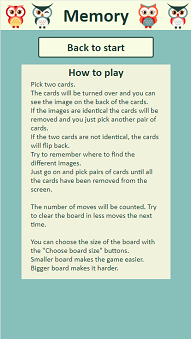

<h1 align="center">Memory Game</h1>

This is a small interactive web based memory game.  
The site's goal is to offer a relaxing game, yet challenging for the mind.  
[View the live project here.](https://odden69.github.io/memory-game/)  

## User Experience (UX)
### User stories
- #### First Time Visitor Goals
  - As a first time visitor I want to be able to easily see the purpose of the game and to intuitively be able to figure out how it is played or easily find out how.
  - As a first time visitor I want to find the environment easy to navigate and the colour scheme appealing to the eye.

- #### Returning Visitor Goals
  - As a returning visitor, I want to be able to just play the game without any detours. 
  - As a returning visitor, I want to be able to choose a harder, or easier, level of the game than I tried before.

### Design
- #### Colour Scheme
    The colour scheme is chosen to give a soothing feeling and not be a distraction from the challenge of the game. It is consistent throughout the site and the colours of text and back- and foregrounds follow the recommendations for contrasts.
    Find the link to the contrast check [here](https://contrast-grid.eightshapes.com/?version=1.1.0&background-colors=&foreground-colors=%23F7FCE2%2C%20Buttons%20and%20header%0D%0A%23193C32%2C%20Text%0D%0A%2387BFBB%2C%20Background%0D%0A&es-color-form__tile-size=compact&es-color-form__show-contrast=aaa&es-color-form__show-contrast=aa&es-color-form__show-contrast=aa18&es-color-form__show-contrast=dnp).

- #### Typography
    Gill Sans is the font used throughout the site. Four fonts have been added as fall back fonts in case the font is not available on the user's browser (Default fonts given by gitPod when Gill Sans is chosen). It has sans-serif as the final fall back font.  

- #### Imagery
    The images, both on the back and the front of the cards, are chosen to bring the mind back to ones childhood's memory games.
        
### Wireframes
The wireframes were made in Balsamiq.  
The game pages viewed on a mobile device:  
  
The basic idea of applying the same pages to a larger screen:  

## Features
### Existing Features
- The starting page consists of three buttons with links to the other pages. The user can choose between: 
  - Reading about how the game is played.
  - Change the size of the game board to make the game harder or easier.
  - Play the game.  

- On the "how to play" page the player can:
  - Learn how the game is played and what the scoring is based on.  
  - Go back to the starting page.  

- The "choose board size" page gives the player an option to choose between different difficult levels by changing the size of the game board:
  - Four different board sizes are provided. The selected board size is highlighted with a switch of text and button colours.  
  - After selecting board size the player can decide to either play the game directly or go back to the starting page.  

- The "play game" page provides these features:
  - The game board, with a number of randomly placed cards, where the back of the cards is visible.
    - When the player picks two cards, the cards are turned over to show the image on the front of the cards.
    - If the cards are identical the cards are removed from the board.
    - If they are not identical the cards are turned back.
  - A counter keeps track of how many moves the player has made.
  - The player can abort the game at any point and go back to the start page via the quit game button.   

- When the player finishes the game a "finished game" page appears with the result of the game and three choices for the player:
  - Play the game again.  
  - Choose another board size.
  - Go back to the start page.   

### Features Left to Implement
- A high score list would be nice to implement in the game in the future.
- I would also like to add an alternate set of images to make it possible to choose an even harder version of the game.

## Technologies Used

### Languages Used
-   HTML
-   CSS
-   JavaScript

### Programs Used
- The [Gitpod](http://gitpod.io) terminal was used for writing the code, committing it to Git and pushing it to GitHub.
- [Git](https://git-scm.com/) was used for version control.
- [GitHub](https://github.com/) is used to store the project's code and to deploy the project to GitHub pages.
- [Balsamiq](https://balsamiq.com/) was used to create the wireframes during the design process.
- All images were manipulated, cropped and resized using MS Paint and MS Paint 3D.

### Other Used Applications
- All images were compressed using [Optimizilla](https://imagecompressor.com/).
- [coolors](https://coolors.co/) was used to pull colours from the pattern on the back of the cards to create the colour scheme of the game.
- The contrast of the colour scheme was checked on [Contrast Grid](https://contrast-grid.eightshapes.com/?version=1.1.0&background-colors=&foreground-colors=%23F7FCE2%2C%20Buttons%20and%20header%0D%0A%23193C32%2C%20Text%0D%0A%2387BFBB%2C%20Background%0D%0A&es-color-form__tile-size=compact&es-color-form__show-contrast=aaa&es-color-form__show-contrast=aa&es-color-form__show-contrast=aa18&es-color-form__show-contrast=dnp).
- The project plan was made in google document. A pdf of it can be found [here](assets/documents/PP2-project plan.pdf)

## Testing
- __CSS:__ No errors were returned when passing through the official [Jigsaw Validator](https://jigsaw.w3.org/css-validator/validator?uri=https%3A%2F%2Fodden69.github.io%2Fmemory-game%2Findex.html&profile=css3svg&usermedium=all&warning=1&vextwarning=&lang=sv).  
  One warning was returned: -webkit-backface-visibility is a vendor extension.
  But for compatibility reasons, the warning is ignored. 
- __HTML:__ No errors were returned when passing through the official [W3C Validator](https://validator.w3.org/nu/?doc=https%3A%2F%2Fodden69.github.io%2Fmemory-game%2Findex.html).  
  One warning was returned: Section lacks heading. But since the content of the section element is loaded by JavaScript, the warning is ignored.
- __JavaScript:__ No errors were returned when passing through the official JSHint Validator.  
  A few warnings were returned at first which were easily fixed, like a couple of missing semicolons etc.  
  One more severe warning was: Function declarations should not be placed in blocks. This warning was solved by moving a couple of functions outside of their blocks.  
  One final warning: Functions declared within loops referencing an outer scoped variable may lead to confusing semantics. This issue was not solved, despite efforts. But I was adviced by more experienced coders that this technically is a false positive and can be ignored.  
  The following metrics were returned:
  - There are 40 functions in this file
  - Function with the largest signature take 2 arguments, while the median is 0.
  - Largest function has 18 statements in it, while the median is 5.5.
  - The most complex function has a cyclomatic complexity value of 5 while the median is 1.
- __Lighthouse:__ The results of the lighthouse evaluation in the Chrome development tool for both desktop and mobile looked like this:  

- __Wave:__ Additional testing of accessibility for all game pages was made with Wave browser extension. No errors were returned in the tests.
- __Responsivity:__ The Chrome development tool has been used to check the responsivity of the web-site. The site works well on all the available predefined screen sizes as well as on larger screens.
- __Compatibility:__ The site has been checked for compatibility on Chrome, Edge, Firefox and Safari. The game's compatibility has also been tested on a set of different real life devices and was found to work fine.

### Testing User Stories from User Experience (UX) Section

- #### First Time Visitor Goals
  - The image on the first page helps anyone, who might not remember the name of the game, to realize what game it is.
  - If the rules of the game are unclear the player can easily find the information.
  - The environment is easy and intuitive to navigate for a first time visitor.

- #### Returning Visitor Goals
  - A returning visitor can easily just push the Play Game button to play the game without detours.
  - The game offers four different levels of difficulty for a player to choose from.

### Further Testing
The game was tested throughout the development process and a number of bugs were found and resolved. A couple of examples:
- Several different phenomenon occurred before I managed to get the event listeners right and the cards to turn and turn back as they were supposed to.
- The game broke if the player pushed the quit game button before the cards had turned back.
This was solved with an if statement checking that the card divs id have a valid value.

### Known Bugs
No know bugs remain.

## Deployment
### GitHub Pages
This site was deployed to GitHub pages. To deploy a site, follow these steps:
- Find the GitHub repository of the project you wish to deploy.
- Click on Settings. The button to the far right in the menu.
- Scroll down and click on the Pages section.
- Under Source, select main in the dropdown menu.
- Click Save and the page will refresh automatically.
- To confirm your deployment, text on a blue ribbon will tell you: "Your site i ready to be published at  
https://odden69.github.io/memory-game/

## Credits
### Code
Apart from finding inspiration in the course material from Code Institute I found myself getting general information about JavaScript and CSS on these websites: [W3Schools](https://www.w3schools.com/), [CSS-TRICKS](https://css-tricks.com/) and [stackoverflow](https://stackoverflow.com/).
- The card flip function which uses css transform, transition and backface-visibility properties to function, came from [w3Schools](https://www.w3schools.com/howto/howto_css_flip_image.asp).
- The time delay function when the cards are turned was found on [w3Schools](https://www.w3schools.com/jsref/met_win_settimeout.asp).

### Media
Both the pattern on the backside of the cards and the images on the cards were collected from [vecteezy.com](https://www.vecteezy.com).
- Pattern on the backside of the cards: [Pattern Vectors by Vecteezy](https://www.vecteezy.com/vector-art/139382-cute-buho-seamless-patterns")
- Card images: [Human Vectors by Vecteezy](https://www.vecteezy.com/vector-art/1337877-set-of-children-toys)

## Acknowledgements
First I want to thank my Mentor, Narender Singh, who gave me with lots of valuable advice and support during the development process. I have learnt a lot from him that I will benefit from in my future coding career.  
My fellow slackers deserve, as usual, a big thank you for support and encouragement. No one mentioned, no one forgotten. 
But the team from Code Institute's 2021 Retro Gaming Hackathon ["Team Noiseland"](https://github.com/andrewdempsey2018/The-Never-Ending-Coding-Adventure-Codehog-Day) needs mentioning since they have done a super job evaluating the game and trying to find bugs.

## Conclusion
Coding a responsive game for the first time in my life has been challenging but utterly amazing!  
I don't understand why it took me this long to go down this path and learn coding for real. 
